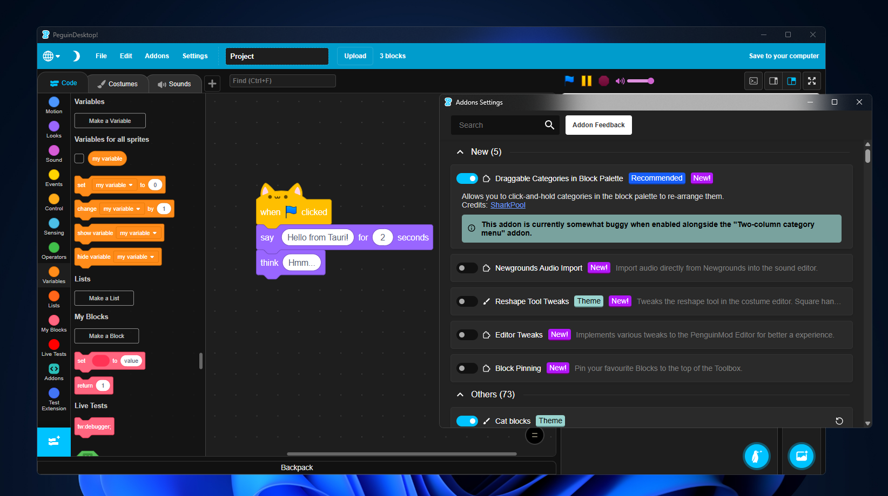

# PenguinDesktop

This is an experimental unofficial offline desktop app for [Penguinmod](http://studio.penguinmod.com/editor.html).

This project works by building the penguinmod editor and pack it using Tauri. To improve user experience I've injected compiled typescript into the built penguinmod editor at runtime, Thereforce modify the editor for QoL features.

# QoL/Features
- Able to upload to penguinmod using external by serve a tiny localhost server 
- Built in Discord RPC
- Perverse addons on each updates/reinstall 
- Handle .pmp files when click on it
- Native close/alert thing idk

# Contributing

Please follow [Tauri's prerequisites](https://tauri.app/start/prerequisites/) before contributing.

The injection code is at `/src-tauri/src/typescript/` fyi, please declare if your PR's code is AI generated. Thanks. 